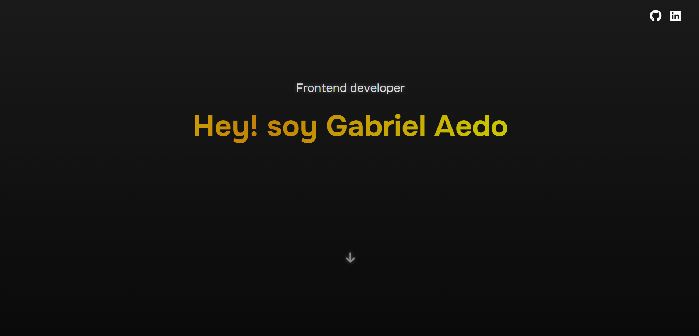

<h1 align="center">Hola, soy Gabriel Aedo 👋</h1>

💻 Desarrollador Frontend | 🧠 Aprendiendo todos los días | 🇵🇪 Lima, Perú

---

### 🎯 Yo

Soy un desarrollador frontend entusiasta que empezó a programar hace 9 meses. Hace 7 descubrí el mundo del frontend y me encantó. Desde entonces no he parado de aprender.

Me gusta crear sitios web bonitos, funcionales y rápidos usando HTML, CSS, JavaScript, Astro y Tailwind Ahora estoy aprendiendo React, SQL y Next js porque quiero seguir creciendo y algún día ser fullstack.

Soy muy curioso, autodidacta y disfruto mucho cada proyecto que hago. Me gusta ayudar, compartir lo que aprendo y trabajar en equipo.

### 🧑‍💻 Sobre mí

- 🔥 Apasionado por la tecnología y el desarrollo web.
- 🧩 Me encanta resolver problemas con código.
- 📚 Actualmente aprendiendo **React**, **Tailwind CSS** y **Bootstrap**.
- 🎯 Mi meta: convertirme en un desarrollador fullstack experto.
- 💼 Trabajo como freelancer para pequeños negocios.

---

### 🚀 Tecnologías que uso

---

#### 🎨 Portafolio Web

  

Mi portafolio hecho con Astro y Tailwind.

---

### 📫 Contacto

- ✉️ **aedothegabriel@gmail.com**
- 💼 [LinkedIn](https://www.linkedin.com/in/tu-perfil)
- - 🌐 [portafolio](https://gabrielaedopozo.github.io/portafolio1/) 

---

  

---

> 💬 *"solo se necesita una computadora y una persona llena de ganas de aprender"*
