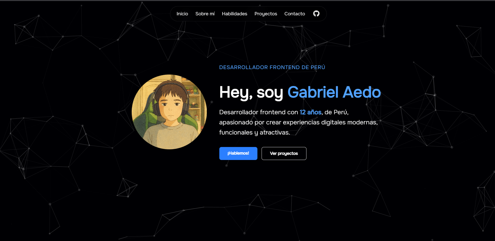
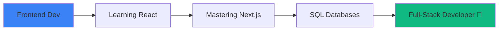

<div align="center">

<!-- Animated Header -->


<!-- Typing SVG -->
<a href="https://git.io/typing-svg">
  
</a>

---

### 🌟 About Me

```javascript
const gabriel = {
    location: "Lima, Peru 🇵🇪",
    code: ["HTML", "CSS", "JavaScript", "React", "Astro"],
    currentlyLearning: ["Next.js", "SQL", "TypeScript"],
    askMeAbout: ["web dev", "frontend", "design", "coffee ☕"],
    funFact: "Started coding 1 year ago and haven't stopped since! 🔥",
    goal: "Become a Full-Stack Developer 🎯"
};
```

</div>

---

<div align="center">

## 🛠️ Tech Stack

<table>
<tr>
<td align="center" width="96">

<br>HTML5
</td>
<td align="center" width="96">

<br>CSS3
</td>
<td align="center" width="96">

<br>JavaScript
</td>
<td align="center" width="96">

<br>React
</td>
<td align="center" width="96">

<br>Next.js
</td>
<td align="center" width="96">

<br>Astro
</td>
</tr>
<tr>
<td align="center" width="96">

<br>Tailwind
</td>
<td align="center" width="96">

<br>Git
</td>
<td align="center" width="96">

<br>Github
</td>
<td align="center" width="96">

<br>VS Code
</td>
<td align="center" width="96">

<br>Figma
</td>
<td align="center" width="96">

<br>Vercel
</td>
</tr>
</table>

</div>

---

<div align="center">

## 📊 GitHub Stats


</div>

---

<div align="center">

## 🎨 Featured Project

### 💼 My Portfolio

<a href="https://portfolio-plum-omega-80.vercel.app/" target="_blank">
  
</a>

**Built with:** Astro ⚡ • Tailwind CSS 🎨 • JavaScript 💛

<a href="https://portfolio-plum-omega-80.vercel.app/" target="_blank">
  
</a>

</div>

---

<div align="center">

## 🎯 Current Focus


```mermaid
graph LR
    A[Frontend Dev] --> B[Learning React]
    B --> C[Mastering Next.js]
    C --> D[SQL Databases]
    D --> E[Full-Stack Developer 🚀]
    style A fill:#3B82F6
    style E fill:#10B981
```

</div>

---

<div align="center">

## 🏆 Achievements


</div>

---

<div align="center">

## 📫 Let's Connect!

<a href="mailto:aedothegabriel@gmail.com">
  
</a>
<a href="https://www.linkedin.com/in/tu-perfil">
  
</a>
<a href="https://gabriel-aedo.pages.dev/">
  
</a>

</div>

---

<div align="center">

### 💭 Dev Quote of the Day


</div>

---

<div align="center">

### 🐍 Contribution Snake

<picture>
  <source media="(prefers-color-scheme: dark)" srcset="https://raw.githubusercontent.com/gabrielaedo/gabrielaedo/output/github-contribution-grid-snake-dark.svg">
  <source media="(prefers-color-scheme: light)" srcset="https://raw.githubusercontent.com/gabrielaedo/gabrielaedo/output/github-contribution-grid-snake.svg">
  
</picture>

</div>

---

<div align="center">

### 👀 Profile Views


</div>

---

<div align="center">

### 🎵 Coding Vibes


*Currently playing while coding 🎧*

</div>

---

<div align="center">

**✨ "All you need is a computer and the will to learn." ✨**


</div>
