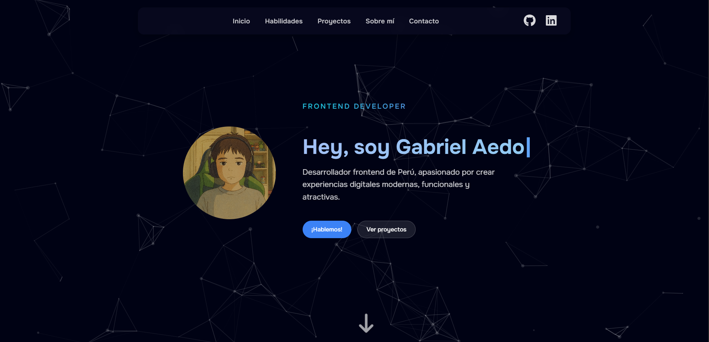

<h1 align="center">Hi, I'm Gabriel Aedo 👋</h1>

💻 Frontend Developer | 🧠 Learning Every Day | 🇵🇪 Lima, Peru

---

### 🎯 About Me

I'm an enthusiastic frontend developer who started programming 1 year ago. Around 9 months ago, I discovered the world of frontend development — and I loved it. Since then, I haven’t stopped learning.

I enjoy building beautiful, functional, and fast websites using **HTML**, **CSS**, **JavaScript**, **Astro**, and **Tailwind CSS**.  
Currently, I’m learning **React**, **SQL**, and **Next.js** because I want to keep growing and eventually become a **full-stack developer**.

I’m very curious, self-taught, and passionate about every project I build. I love helping others, sharing what I learn, and collaborating with teams.

---

### 🧑‍💻 More About Me

- 🔥 Passionate about technology and web development  
- 🧩 I love solving problems with code  
- 📚 Currently learning **React** and *SQL*  
- 🎯 My goal: to become an expert full-stack developer  
- 💼 Working as a freelancer for small businesses  

---

### 🚀 Technologies I Use

---

#### 🎨 Web Portfolio

  

My portfolio built with Astro

---

### 📫 Contact

- ✉️ **aedothegabriel@gmail.com**  
- 💼 [LinkedIn](https://www.linkedin.com/in/tu-perfil)  
- 🌐 [Portfolio](https://gabriel-aedo.pages.dev/)  

---

  

---

> 💬 *"All you need is a computer and the will to learn."*

